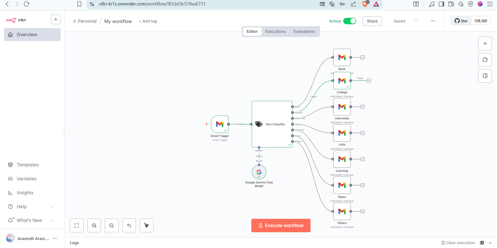
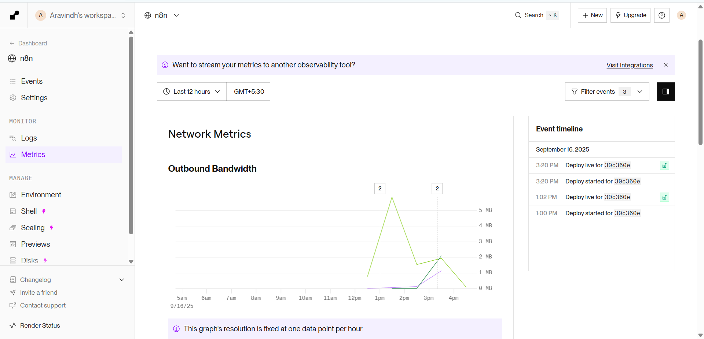
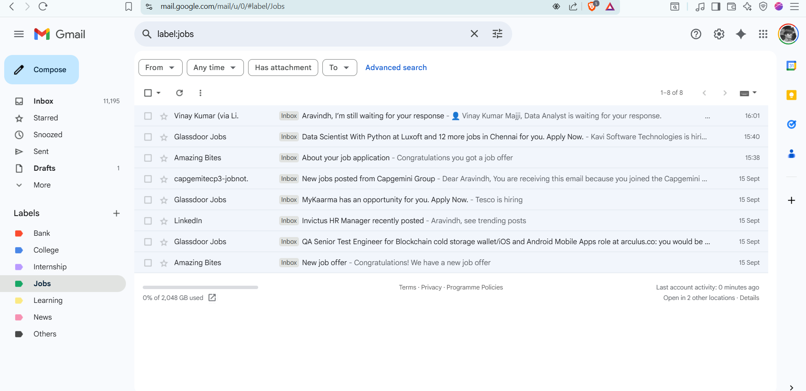

### AI-Powered Email Organizer

**This project is my solution to a problem I think we all face: a chaotic and overwhelming email inbox. I was tired of sifting through promotions and newsletters to find that one important email about a job application or a bank update.**

So, I decided to build a small, smart assistant that lives in the cloud and sorts my emails for me, 24/7. This repository documents that journey.

---

### Preview

### 🔹 WorkFlow
  

### 🔹 Metrics
  

### 🔹 Output
  

---

### So, What Does It *Actually* Do?

Simple: It watches my Gmail inbox around the clock. The moment a new email lands, it springs into action:

* **It Reads the Email:** It looks at who sent it and what it's about.
* **It Thinks:** It decides if the email belongs to an important category I've set up, like `Jobs`, `Bank`, `College`, etc.
* **It Acts:** It instantly applies the correct label in Gmail, so when I open my inbox, everything is already neatly organized.
* **It's Always On:** Because it's hosted on Render, it does all of this whether my computer is on or off.

---

### My Toolkit: The Tech I Used

I pieced this together with a few of my favorite modern tools:

* **n8n:** The brain of the operation. I chose n8n because it's a powerful visual workflow builder. It let me design the logic without getting lost in boilerplate code.
* **Docker:** This was key for packaging the n8n instance so it could run anywhere.
* **Render:** My choice for hosting. Their free tier is perfect for personal projects like this, and deploying a Docker container was incredibly smooth.
* **Google Cloud & Gmail API:** The bridge that connects my n8n workflow to my actual inbox, giving it the permissions it needs to read and label emails securely.

---

### If you want to get this running for yourself, you absolutely can!

1.  **Get the Code:** Clone this repository or download the `workflow.json` file.
2.  **Google Cloud Setup:** You'll need to set up your own project on the Google Cloud Platform to get your own `Client ID` and `Client Secret` for the Gmail API. Make sure you enable the API and set the correct redirect URIs for your n8n instance!
3.  **Deploy n8n:** I'd recommend deploying the official n8n Docker image to Render, just like I did.
4.  **Set Environment Variables:** In your Render service, you **must** set the `WEBHOOK_URL` to your public Render URL, and `N8N_HOST` to `0.0.0.0`.
5.  **Import & Configure:** Import my `workflow.json` file into your n8n instance and plug in your own Google credentials.

---

⚠️ This workflow does not include API keys or secrets. You will need to configure your own Gmail API / Google Gemini API credentials in your n8n instance to make it work.

Thanks for checking out my project! Feel free to fork it, ask questions, or suggest improvements.

Happy automating!
